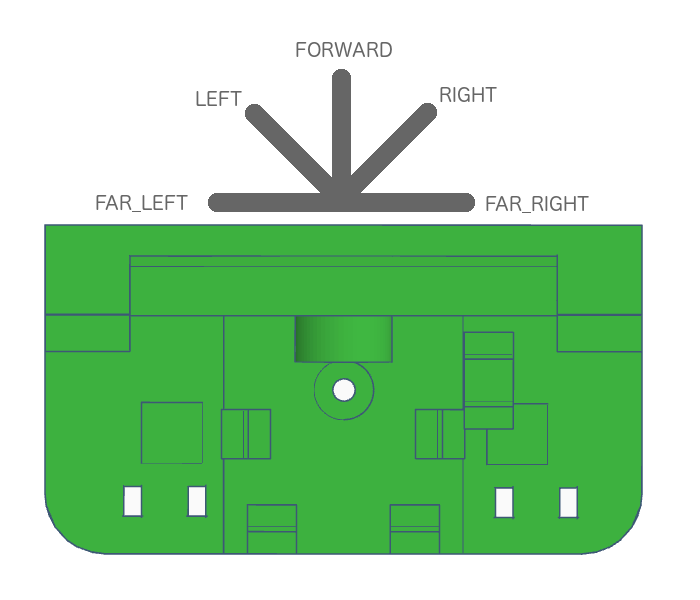

# Landje Robot Instructionset


The Landje robot has its own instruction set. With these instructions you can easily control the robot.

Every program for a Landje Robot must start with the following instructions. You do not need to understand these instructions, just copy and paste these instructions when you start a new program. 

```
#include <LandjeRobot.h>

// Robot motor connections
const int motor[2][4] = {
  {2, 3, 4, 5}, {6, 7, 8, 9}
};

// Line sensor connections
const int lineSensors[2] = { 10, 11 };
const bool lineSensorInverse = false;

// Wheel circumference in cm
const int wheelRadiusMM = 21;
// Track width in cm
const int trackWidthMM = 55;

// Ultrasonic sensor connections
int ultraPin = 13;

// Servo connections
int servoPin = 14;

// Led connection
int mouthledPin = 15;

// Mode switch connection
int switchPin = 0;

LandjeRobot landjerobot(motor, LandjeRobotMotorController::STEPMODE::FULL_STEP, wheelRadiusMM , trackWidthMM, lineSensors, lineSensorInverse, ultraPin, servoPin, mouthledPin, switchPin);
```

These instructions must be placed in the program before the *setup()* function. Cut and paste these instructions into every program you write for the robot.


## The robot instructionset             

The Landje robot has several unique instructions. You have instructions to move, turn or,for example, to measure the distance. When you give these instructions the Landje Robot will then executed these instructions. You will see the line below in the first part of the program.

`LandjeRobot landjerobot(motor, LandjeRobotMotorController::STEPMODE::FULL_STEP, wheelRadiusMM ,
trackWidthMM, lineSensors, lineSensorInverse, ultraPin, servoPin,mouthledPin);`

With this long instruction the robot is set up. After executing this instruction you can use the variable `landjerobot` to give instructions to the robot. You give an instruction by adding the instruction to the variable `landjerobot`. You add an instruction to landjerobot by means of a dot. For example;  

`landjerobot.talk(5);` 

Pasting an instruction behind the variable `landjerobot`, is called *giving* an instruction. So if the instruction says '*give the instruction move*' you program `landjerobot.move()`. In the next section you will learn more about all the special instructions that the Landje robot understands. 

### The Landje robot instructionset

The Landje robot has several instructions. With some instructions you can or must give something extra to the instruction. For example, if you want the robot to move, you can tell it which direction to drive in. To tell something extra to an instruction is called *passing*. You *pass* to the instruction `move` which direction it should drive in.

`landjerobot.move(LandjeRobot::DIRECTION::FORWARD); `

With `LandjeRobot::DIRECTION::FORWARD` you pass to the land robot that it must move forward. You tell the LandjeRobot robot to move in the DIRECTION `FORWARD`. 

The information you pass on to the robot is called *parameter*. None, one or more parameters can be passed on to each instruction. How much and which parameters you can pass on differs per instruction.

Some instructions allow you to specify some parameters, but you don't have to. If you give the instruction `move` you may specify the parameter *waiting*, but it is not necessary. So you may give the instruction `landerobot.move(LandjeRobot::DIRECTION::FORWARD,10)` but also `landerobot.move(LandjeRobot::DIRECTION::FORWARD)`. At the first instruction the robot will drive 10 centimeters forward. On the second instruction the robot will continue to move forward until you give the instruction to stop. If you do not specify a parameter, a value will be selected. This value is called the *default* value. For the parameter *distance* this is infinite (∞). 

If you look up the parameter for instructions in this manual, there is one value for a parameter _underlined_. This is the *default* value that will be chosen for the parameter if you do not pass the parameter on to the instruction. Take a look at the instruction *move*, it shows the value '∞' which is underlined. The character '∞' means infinite. If you do not specify the parameter *distance*, the robot will continue to drive till you give another instruction to stop driving.

Instructions can also return a value. If an instruction returns a value, this is mentioned in the instruction documentation. The instruction *doIMove* has no parameters, but does return a value. If the robot moves you get *true*, otherwise *false*.
   
### Instructions

#### detectLine

**Description**

Indicates if a line on the floor is detected.

**Syntax**

detectLine();   

**Parameters**

none
        
**Returns**

|Type|Value|Comments|
|:--------|:--------|:------|
|| LandjeRobot::LINE::NONE</br>LandjeRobot::LINE::LEFT</br> LandjeRobot::LINE::RIGHT</br> LandjeRobot::LINE::BOTH | NONE indicates that no line is detected. BOTH is returned if the LEFT and RIGHT BOTH sensors do detect a line. |


**Example**

```

if (detectLine() != LandjeRobot::LINE::NONE) {
    Serial.println("Sensor detected a line");
}

```

#### doIMove

**Description**

Indicates if the robot is moving.

**Syntax**

doIMove();   

**Parameters**

none
        
**Returns**

|Type|Value|Comments|
|:--------|:--------|:------|
|bool| true | This value is returned if the robot is moving |
|bool| false | If the robot is not moving, this vallue is returned |

**Example**

```
// Move the robot in forward direction
landjerobot.move(LandjeRobot::DIRECTION::FORWARD);

if (doIMove()) {
    Serial.println("I am moving now!");
}

```

#### doITalk

**Description**

Indicates if the robot is talking.

**Syntax**

doITalk();   

**Parameters**

none
        
**Returns**

|Type|Value|Comments|
|:--------|:--------|:------|
|bool| true | This value is returned if the robot is talking. |
|bool| false | If the robot does not talk, this value is returned |

**Example**

```
// Make the robot talk for 60 seconds
landjerobot.talk(60);

if (doITalk()) {
    Serial.println("I am talking now!");
}

```

#### look

**Description**

Turn the robot head in a specific direction

**Syntax**

look( direction );   


**Parameters**

|Parameter|Type|Values|Comments|
|:--------|:---|:------|:----------|
| direction | | LandjeRobot::LOOK::FORWARD</br>LandjeRobot::LOOK::LEFT</br>LandjeRobot::LOOK::RIGHT</br>LandjeRobot::LOOK::FAR\_LEFT</br>LandjeRobot::LOOK::FAR\_RIGHT | |

   
   

**Look directions for the robot**


        
**Returns**

nothing

**Example**

```
// Look left
landjerobot.look(LandjeRobot::LOOK::LEFT);
```

#### measureDistance

**Description**

Measures the distance between the robot and another object

**Syntax**

measureDistance();   

**Parameters**

none
        
**Returns**

|Type|Value|Comments|
|:--------|:--------|:------|
|int| 2..400 | Distance in centimetres |


**Example**

```
int measuredDistance = 0;
// Measure the distance between the robot and another object
measuredDistance  = landjerobot.measureDistance();

Serial.print("Measured distance ");
Serial.print(measuredDistance);
Serial.println(" cm");

```

#### mode

**Description**

Indicates the state of the mode switch.

**Syntax**

mode();   

**Parameters**

none
        
**Returns**

|Type|Value|Comments|
|:--------|:--------|:------|
|int| 1 | Switch has state 1 |
|int| 2 | Switch has state 2 |

**Example**

```
if (mode() == 1) {
    Serial.println("Mode 1");
} else {
    Serial.println("Mode 2");
}
```

#### mouthClosed

**Description**

Let the robot keep his mouth shut by turning off the led

**Syntax**

mouthClosed();   


**Parameters**

none
        
**Returns**

nothing

**Example**

```
// Shut the robots mouth
landjerobot.mouthClosed();
```

#### mouthOpen

**Description**

Let the robot open its mouth by turning on the led

**Syntax**

mouthOpen();   

**Parameters**

none
        
**Returns**

nothing

**Example**

```
// Let the robot open its mouth
landjerobot.mouthOpen();
```


#### move

**Description**

Move the robot in one direction

**Syntax**

move( direction );   
move( direction , distance);   
move( direction , distance, wait);


**Parameters**

|Parameter|Type|Values|Comments|
|:--------|:---|:------|:----------|
| direction | | LandjeRobot::DIRECTION::STOP </br>LandjeRobot::DIRECTION::FORWARD</br>LandjeRobot::DIRECTION::BACKWARD | |
| distance |int| 0 .. _∞_| The distance to be moved in centimetres |
| wait |bool| true</br>_false_ | Wait (true) by carrying out the next instruction until the specified distance has been covered |

        
**Returns**

nothing

**Example**

```
// robot moves in forward direction
landjerobot.move(LandjeRobot::DIRECTION::FORWARD);

// moves the robot 10cm backwards
landjerobot.move(LandjeRobot::DIRECTION::BACKWARD,10);

// move the robot 20cm in forward direction and 
// wait until the specified distance has been covered
landjerobot.move(LandjeRobot::DIRECTION::FORWARD,20,true);
```

#### talk

**Description**

Let the robot 'talk' by letting the led blink randomly

**Syntax**

talk( duration );   


**Parameters**

|Parameter|Type|Values|Comments|
|:--------|:---|:------|:----------|
| duration | int | 0..∞ | Duration the robot 'talks'|

        
**Returns**

nothing

**Example**

```
// Talk for 7 seconds
landjerobot.talk(7);
```

#### turn

**Description**

Turn the robot in a certain direction 

**Syntax**

turn( direction );   
turn( direction , angle);   
turn( direction , angle, wait);


**Parameters**

|Parameter|Type|Values|Comments|
|:--------|:---|:------|:----------|
| direction | | LandjeRobot::TURN::STRAIGHT</br>LandjeRobot::TURN::LEFT</br>LandjeRobot::TURN::RIGHT | The direction of rotation of the robot. The Value STRAIGHT resets the direction and makes the robot move straight forward or backward |
| hoek |int| 0..360 </br>_90_| The number of degrees the robot should rotate. An angle of 90 degrees is a right angle |
| wait |bool| true</br>_false_ | Wait (true) to carry out the following instruction until the specified distance has been covered |

**Turn directions of the robot**

        
**Returns**

nothing

**Example**

```
// turn the robot left in a right angle
landjerobot.turn(LandjeRobot::TURN::LEFT);

// rotate the robot 360 degrees around its axis 
landjerobot.turn(LandjeRobot::TURN::RIGHT,360);

```


## Arduino instructies

Arduino instructions are for all Arduino computers, so not especially for this robot. Where at Landje Robot instruction you have to type `landjerobot.` for the instruction, you don't have to and can't do this for Arduino instructions. With Arduino instructions you just use the instruction name.

If you want to learn more instructions from the Arduino, you can take a look at the [Arduino Language Referece](https://www.arduino.cc/reference/en/).

#### delay

**Description**

Wait a few milliseconds. Thousand (1000) milliseconds is equal to 1 second.

**Syntax**

delay( duration );   

**Parameters**

|Parameter|Type|Valuen|Comments|
|:--------|:---|:------|:----------|
| duration | int | 0..∞ | Number of milliseconds to wait.|

        
**Returns**

nothing

**Example**

```
// Wait 2 seconds
delay(2000); 
```


#### random

**Description**

Enter a random number

**Syntax**

random( smallest number, largest number );   

**Parameters**

|Parameter|Type|Valuen|Comments|
|:--------|:---|:------|:----------|
| smallest number | int | 0..∞ | Smallest number that can be returned as a random number |
| largest number | int | 0..∞ | Largest number that can be returned as a random number |

        
**Returns**

|Type|Value|Comments|
|:--------|:--------|:------|
|long| - | A random number equal to or greater than the smallest number specified and equal to or smaller than the largest number specified. |

The type ```long``` is niet explained. But for the robot, you can also use the type  ```int```.


**Example**

```
// Enter a random number,
// greater than or equal to 10 and
// Less than or equal to 20
int a = random(10,20); 
```
